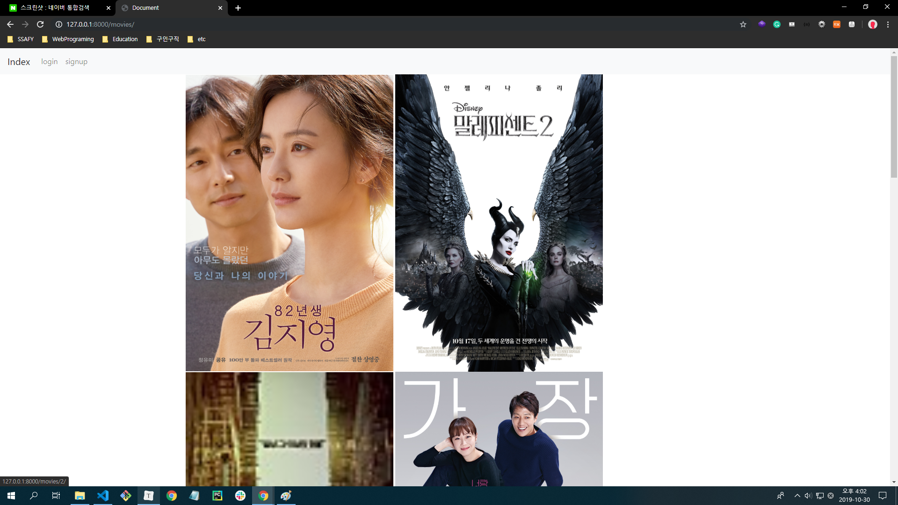
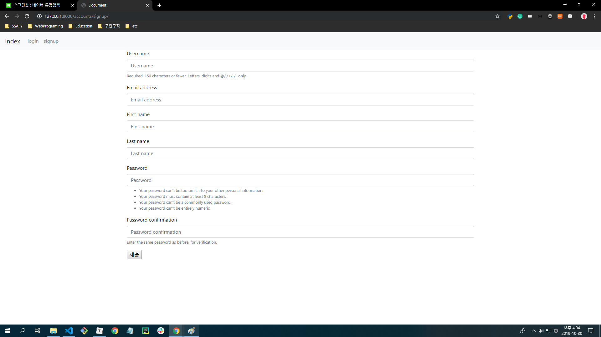
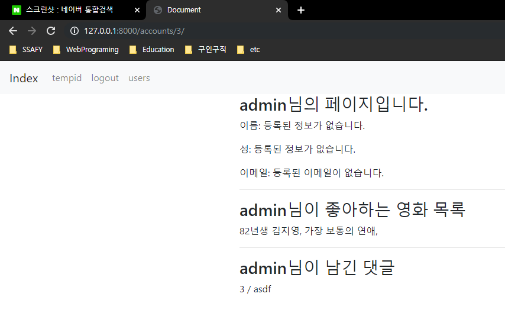
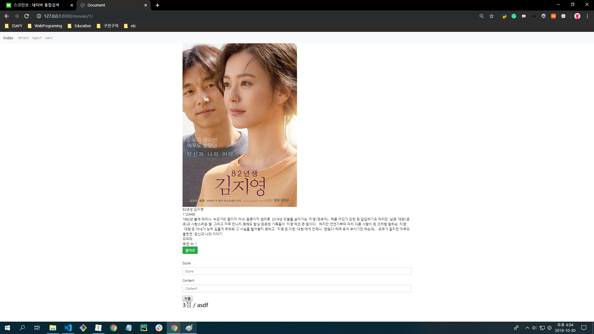

#### 2019년 10월 30일

# project06 - DataBase

> MADE BY_최수빈, 김상돈
>
> 협업을 통한 DB 모델링 및 기능 구현
>
> 다양한 DB의 관계 설정(장르와 영화 => 1:N, 영화와 리뷰 => 1:N, 유저와 영화하나에 대한 리뷰 => 1:N, 유저와 좋아요 => N:M)
>
> (꾸미기(css)는 다음에...)

### 1. accounts App 의 forms.py 파일

```python
from django import forms
from django.contrib.auth.forms import UserCreationForm

# UserCreationForm 에서 추가적인 정보를 더 입력받기 위해 fields에 입력받고 싶은 정보를 기입해 준다.
class CustomUserCreationForm(UserCreationForm):
    class Meta(UserCreationForm.Meta):
        fields = ('username', 'email', 'first_name', 'last_name',)
```

### 2. movies App 의 models.py 파일

```python
from django.db import models
from django.conf import settings

class Genre(models.Model):
    name = models.CharField(max_length=100)
    def __str__(self):
        return self.name

class Movie(models.Model):
    title = models.CharField(max_length=100)
    audience = models.IntegerField()
    poster_url = models.CharField(max_length=100)
    description = models.TextField()
    genre = models.ForeignKey(Genre, on_delete=models.CASCADE) # 장르(1) : 영화(N) 관계 설정
    like_users = models.ManyToManyField(settings.AUTH_USER_MODEL, related_name="like_movies") # 영화에 좋아요를 누른 유저(M) : 유저가 좋아요를 누른 영화(N) 관계 설정
    def __str__(self):
        return self.title

class Review(models.Model):
    content = models.CharField(max_length=100)
    score = models.IntegerField()
    movie = models.ForeignKey(Movie, on_delete=models.CASCADE) # 영화(1) : 리뷰(N) 관계 설정
    user = models.ForeignKey(settings.AUTH_USER_MODEL, on_delete=models.CASCADE) # 유저(1) : 리뷰(N) 관계 설정
```

### 3. 결과물 Screenshot

​	3-1. index(logout)




​	3-2. signup




​	3-3. index(login)


​	3-4. user_detail




​	3-5. movie_detail

